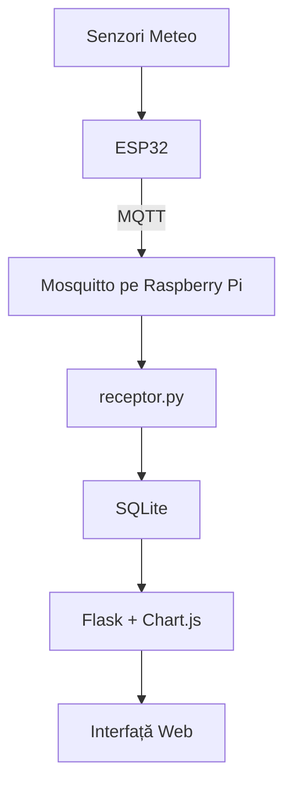
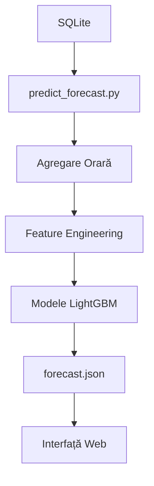

# Stație Meteo Inteligentă Autonomă

Acest repository conține implementarea unei stații meteorologice inteligente realizate ca proiect de licență. Sistemul colectează date meteorologice locale cu ajutorul unui nod ESP32, transmite măsurătorile prin MQTT către un server Raspberry Pi, stochează datele într-o bază SQLite, le afișează într-o interfață web și generează prognoze pe termen scurt folosind modele LightGBM.

## Funcționalități

- Colectarea parametrilor meteorologici locali
- Măsurarea temperaturii, umidității, presiunii atmosferice și radiației UV
- Măsurarea vitezei vântului, rafalelor, direcției vântului și precipitațiilor
- Transmiterea datelor prin MQTT de la ESP32 către Raspberry Pi
- Stocarea măsurătorilor într-o bază de date SQLite
- Vizualizarea datelor într-o interfață web realizată cu Flask și Chart.js
- Generarea prognozelor meteo pentru intervale între +3h și +24h
- Automatizarea serviciilor folosind systemd și cron

## Arhitectura Sistemului

Sistemul este împărțit în două componente principale.

### Nod ESP32

- Citește valorile de la senzorii meteorologici
- Agregă local măsurătorile
- Publică periodic date în format JSON prin MQTT

### Server Raspberry Pi

- Rulează brokerul Mosquitto
- Primește și procesează mesajele MQTT
- Stochează măsurătorile în SQLite
- Rulează aplicația Flask pentru vizualizare
- Rulează modulul de predicție bazat pe LightGBM

### Fluxul Datelor



### Fluxul de Prognoză



## Componente Hardware

| Componentă | Rol |
|------------|-----|
| ESP32 | Nod de colectare date |
| Raspberry Pi | Server central |
| BME280 | Temperatură, umiditate și presiune |
| ML8511 | Radiație UV |
| Anemometru Misol | Viteza vântului |
| Giruetă Misol | Direcția vântului |
| Pluviometru Tipping Bucket | Precipitații |
| Panou solar + UPS-15W | Alimentare autonomă |
| Cutie IP67 | Protecția echipamentelor electronice |
| Stevenson Screen | Protecția senzorului BME280 |

## Tehnologii Utilizate

- ESP32 / Arduino IDE
- MQTT
- Mosquitto
- Python
- Flask
- SQLite
- Chart.js
- LightGBM
- Google Colab
- systemd
- cron

## Structura Proiectului

```text
meteo_app/
│
├── app.py                  # aplicația Flask
├── receptor.py             # receptor MQTT
├── predict_forecast.py     # generare prognoză
├── baza_meteo.db           # baza de date SQLite
├── forecast.json           # ultima prognoză generată
├── metadata.json           # configurația modelelor
│
├── models/
│   └── *.txt
│
├── templates/
│   └── index.html
│
├── static/
│   └── ...
│
└── esp32/
    └── weather_node.ino
```

## Formatul Mesajului MQTT

### Topic

```text
meteo/senzori
```

### Payload JSON

```json
{
  "temperatura": 22.5,
  "umiditate": 45,
  "presiune": 1014.2,
  "viteza_vant": 12.5,
  "rafala": 18.0,
  "uv": 2.1,
  "precipitatii": 0.0,
  "directie_vant": 180
}
```

## API Flask

| Rută | Descriere |
|-------|------------|
| `/` | Afișează interfața web |
| `/api/current` | Returnează ultima măsurătoare salvată |
| `/api/history` | Returnează istoricul recent al măsurătorilor |
| `/api/forecast` | Returnează ultima prognoză generată |

## Modulul de Predicție

Modelele de predicție au fost antrenate în Google Colab folosind date meteorologice istorice.

Caracteristicile utilizate includ:

- Lag features
- Trend features
- Rolling windows
- Codare ciclică a timpului
- Codare sinus/cosinus pentru direcția vântului

Pe Raspberry Pi, modelele sunt utilizate exclusiv pentru inferență. Scriptul `predict_forecast.py` citește datele din SQLite, le agregă la nivel orar, reconstruiește caracteristicile necesare și generează fișierul `forecast.json`.

## Instalare și Rulare

### Instalarea dependențelor

```bash
python3 -m venv mediu_meteo
source mediu_meteo/bin/activate

pip install flask pandas numpy paho-mqtt lightgbm scikit-learn
```

### Pornirea receptorului MQTT

```bash
python receptor.py
```

### Pornirea aplicației Flask

```bash
python app.py
```

### Generarea prognozei

```bash
python predict_forecast.py
```

## Automatizare

Pentru funcționare continuă, sistemul poate fi configurat folosind:

- `mosquitto.service`
- `meteo_receptor.service`
- `meteo_web.service`
- `cron` pentru rularea periodică a scriptului `predict_forecast.py`

## Securitate

Datele sensibile nu trebuie încărcate în repository. Acestea includ:

- Parole Wi-Fi
- SSID-uri
- Adrese IP locale
- Chei API

Se recomandă utilizarea unor fișiere ignorate prin `.gitignore`, precum:

```text
config.local.h
.env
```

## Stadiul Proiectului

Fluxul complet este implementat și funcțional:

```text
Senzori → MQTT → SQLite → Flask → Interfață Web → Prognoză LightGBM
```
